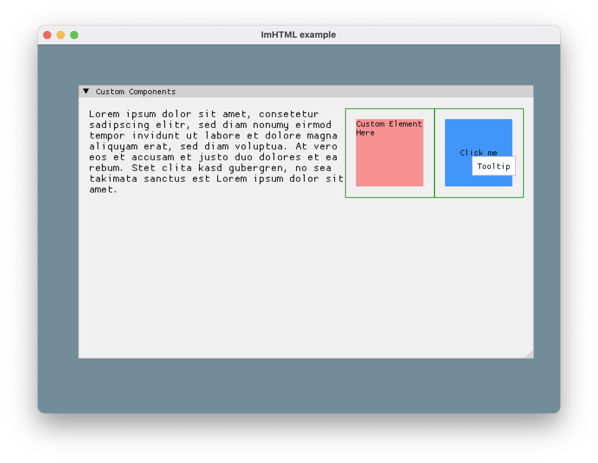

# ImHTML

[](https://github.com/BigJk/ImHTML/releases)

ImHTML is a simple HTML renderer for ImGui. It is based on the awesome [litehtml](https://github.com/litehtml/litehtml) library, which is responsible for understanding HTML and CSS. ImHTML implements the needed container to render the content to ImGui.

> [!WARNING]
> I quickly extracted this from a pet project of mine and decided to make it a library. Expect bugs and missing features.

## Video

https://github.com/user-attachments/assets/efc9b341-7f4a-4626-96b8-618c568385d0

## Features

- Support a subset of HTML and CSS (see [litehtml](https://github.com/litehtml/litehtml) and [litehtml - CSS Support](https://docs.google.com/spreadsheets/d/1CM6p2BU0XwM7KS0ZUIP7u25g2rrHXKx_ANGdDG98vwc/edit?gid=0#gid=0))
  - Images
  - Links
  - Margin/Padding
  - Flexbox
  - ...
- Regular, Bold, Italic, BoldItalic font styles if you provide the fonts
- Clickable links with `:hover` styling support
- Custom components to insert interactive ImGui widgets into the HTML

### Known Limitations

- `border-radius` per corner is not supported, you can only use `border-radius: Xpx` to set the border radius for all corners
- `border-radius` on images is not supported
- `border` for individual sides is a bit wonky. Using full borders like `border: 2px solid red` works the best.

## Usage

<p align="center">
    
</p>

```cpp
ImHTML::Canvas("my_canvas",
    R"(
    <html>
        <head>
        <title>ImHTML Example</title>
        <style>
            p, h1, h2, h3, h4, h5, h6 {
              margin: 0;
            }
        </style>
        </head>
        <body>
        <h1>ImHTML Example</h1>
        <p style="line-height: 1.2;">Lorem ipsum dolor sit amet, consetetur sadipscing elitr, sed diam nonumy eirmod tempor invidunt ut labore et dolore magna aliquyam erat, sed diam voluptua. At vero eos et accusam et justo duo dolores et ea rebum. Stet clita kasd gubergren, no sea takimata sanctus est Lorem ipsum dolor sit amet. Lorem ipsum dolor sit amet, consetetur sadipscing elitr, sed diam nonumy eirmod tempor invidunt ut labore et dolore magna aliquyam erat, sed diam voluptua. At vero eos et accusam et justo duo dolores et ea rebum. Stet clita kasd gubergren, no sea takimata sanctus est Lorem ipsum dolor sit amet.</p>
        <div style="border: 1px solid white; background-color: green; padding: 30px;">Box Test</div>
        <a href="https://github.com/">GitHub</a>
        </body>
    </html>
    )"
);
```

### Advanced Usage

#### Config

You can change the config using `ImHTML::GetConfig()`, `ImHTML::SetConfig(config)`, `ImHTML::PushConfig(config)` and `ImHTML::PopConfig()`.

> [!IMPORTANT]
> To support images (``) and external css (`<link rel="stylesheet" href="..." />`) loading you need to provide the functions in the config!

```cpp
ImHTML::Config* config = ImHTML::GetConfig();

// Set the base font size
config->BaseFontSize = 16.0f;

// Set the fonts
config->FontRegular = ImGui::GetIO().Fonts->AddFontDefault();
config->FontBold = ImGui::GetIO().Fonts->AddFontDefault();
config->FontItalic = ImGui::GetIO().Fonts->AddFontDefault();
config->FontBoldItalic = ImGui::GetIO().Fonts->AddFontDefault();

// Image loading and meta data reading to support 
config->LoadImage = [](const char* src, const char* baseurl) {
    // - src is the text from the 
    // - you can use stb_image or any other image loader
};
config->GetImageMeta = [](const char* src, const char* baseurl) {
    // - src is the text from the 
    // - fetch the size of the image
    return ImHTML::ImageMeta{width, height};
};
config->GetImageTexture = [](const char* src, const char* baseurl) {
    // - src is the text from the 
    // - return the texture id that ImGui should use
    return (ImTextureID)1;
};

// CSS loading to support <link rel="stylesheet" href="..." />
config->LoadCSS = [](const char* url, const char* baseurl) {
    // - url is the text from the <link rel="stylesheet" href="..." />
    // - you could read from a file, expects the content of the css file
    // - ImHTML::DefaultFileLoader is a simple file loader that you can use
    return ImHTML::DefaultFileLoader(url, baseurl);
};
```

#### Link Clicking

You can get the clicked url by passing a pointer to a string to the `Canvas` function. The function will return `true` if **any** link was clicked.

```cpp
std::string clickedURL = "";
if(ImHTML::Canvas(
    "my_canvas",
    "<html><body><a href=\"my_url\">Some Link</a></body></html>",
    0.0f, // 0.0f for using all available width
    &clickedURL)) {
    // clickedURL will contain "my_url" if the link was clicked
}
```

#### Custom Components

<p align="center">
    
</p>

You can register custom components using `ImHTML::RegisterCustomElement` and `ImHTML::UnregisterCustomElement`. This makes it possible to insert normal ImGui widgets into the HTML.

```cpp
ImHTML::RegisterCustomElement("custom-button", [](ImRect bounds, std::map<std::string, std::string> attributes) {
    // bounds are the available bounds of the parent element in **screen space**
    // attributes are the attributes of the custom element

    ImGui::SetCursorScreenPos(bounds.Min);
    ImGui::Button(attributes["text"].c_str(), bounds.GetSize());
    if (ImGui::IsItemHovered() && attributes.count("tooltip") > 0) {
        ImGui::SetTooltip("%s", attributes["tooltip"].c_str());
    }
});
```

```html
<!-- For now you should use a div with sizing for your custom element -->
<div style="width: 100px; height: 30px;">
  <custom-button text="Click me" tooltip="Tooltip"></custom-button>
</div>
```

## Using the library

Copy `imhtml.cpp` and `imhtml.hpp` to your project and make sure that imgui and litehtml are linked and includes are available. You can download a zip with the files from the release page:

- https://github.com/BigJk/ImHTML/releases

### Linking litehtml with CMake

You can check the example [CMakeLists.txt](CMakeLists.txt) for a usage in the example.

```
# Download and setup litehtml
FetchContent_Declare(
  litehtml
  GIT_REPOSITORY https://github.com/litehtml/litehtml.git
  GIT_TAG d4453f5d4e03cd4d902b867ca553d0ad81b09939 # I had some problems with the latest version, so I used this one
)
set(LITEHTML_BUILD_TESTING OFF CACHE BOOL "Skip building tests" FORCE)
FetchContent_MakeAvailable(litehtml)

# I had some issues with the compiler warnings, so I disabled them
if(TARGET litehtml)
  if(CMAKE_CXX_COMPILER_ID MATCHES "Clang|AppleClang")
    target_compile_options(litehtml PRIVATE
      -Wno-error
      -Wno-reorder-ctor
      -Wno-switch
    )
  elseif(CMAKE_CXX_COMPILER_ID STREQUAL "GNU")
    target_compile_options(litehtml PRIVATE -Wno-error -Wno-reorder -Wno-switch)
  endif()
endif()

# Link against litehtml
target_link_libraries(your_target PRIVATE litehtml)
```

## TODO

- [ ] Better border handling
- [ ] Border radius support for individual corners
- [ ] Handle different list marker styles
- [ ] Handle more edge-cases

## Found the project useful? :smiling_face_with_three_hearts:

[](https://ko-fi.com/A0A763FPT)
